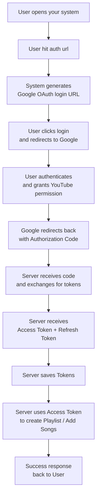

## Flow diagram

```mermaid
flowchart TD
    A[User opens your system] --> B[User hit auth url]
    B --> C[System generates<br/>Google OAuth login URL]
    C --> D[User clicks login<br/>and redirects to Google]
    D --> E[User authenticates<br/>and grants YouTube permission]
    E --> F[Google redirects back<br/>with Authorization Code]
    F --> G[Server receives code<br/>and exchanges for tokens]
    G --> H[Server receives<br/>Access Token + Refresh Token]
    H --> I[Server saves Tokens]
    I --> J[Server uses Access Token<br/>to create Playlist / Add Songs]
    J --> K[Success response<br/>back to User]

```